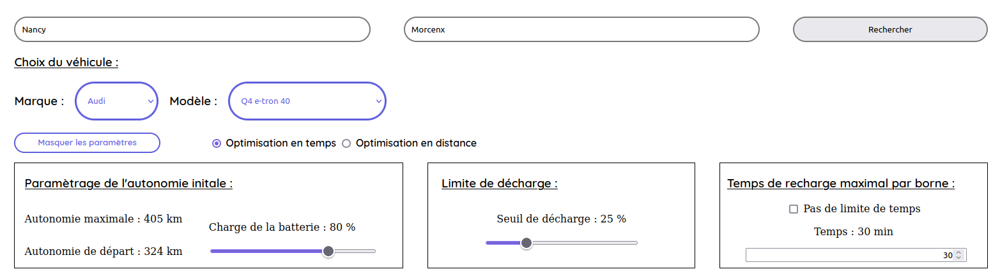
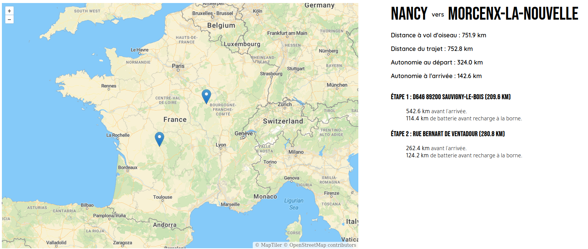
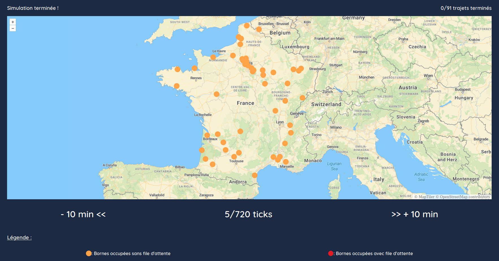

# Itinéraires en voiture électrique et simulation de trafic

## Installation des dépendances

- Librairie `SQLite3` pour C :

```bash
sudo apt-get install libsqlite3-dev
```

- Dépendances `python` :

Une fois placé dans le répertoire `/app`

```bash
pip install - r requirements.txt
```

## Lancement du projet

Une fois placé dans le répertoire `/app`

```bash
make run
```

- Lancement en mode debug
```bash
make run_debug
```

Une fois le projet lancé, ouvrez votre navigateur et tapez l'adresse
```bash
http://127.0.0.1:5000
``` 
Une fois ouvert, le projet est utilisable sous la forme d'une application Web.

Attention, lors d'une simulation, il peut être nécessaire d'utiliser la commande suivante pour que les calculs se fassent.

```bash
 ulimit -n 1048576 
```

## Utilisation de l'application
### `/` : Utilisation du calcul d'itinéraire
Pour lancer une recherche : 
- adresse de départ
- adresse d'arrivée

Vous pouvez choisir vos options : 
- une voiture (Marque & Modèle)
- le type d'optimisation (distance ou temps)
- l'autonomie initiale du véhicule
- le seuil minimal de décharge
- la limite de temps de recharge à la borne

<div style="text-align:center">

<br>
<i>1. Exemple de recherche d'itinéraire</i>
</div>

Une fois que vous avez appuyé sur le bouton recherche, il y a deux possibilités: soit un message d'erreur apparaît car la recherche a échoué, soit une carte apparaît avec des points qui indiquent les bornes de recharge.

<div style="text-align:center">

<br>
<i>2. Exemple d'affichage de requête</i>
</div>

### `/simulation` : Utilisation du module de simulation
En cliquant sur le bouton "Mode simulation" ou en allant sur la route `/simulation`.
Pour lancer une simulation, il faut entrer un entier et appuyer sur générer. 
Le nombre de trajets générés n'est pas exactement celui entré par l'utilisateur, ce qui est normal. Cela vient de la génération aléatoire des trajets.

Après un peu d'attente, vous pouvez naviguez sur la carte en appuyant sur les boutons :
- +10 min
- -10 min

Les bornes occupées apparaîtront. En orange sont représentées les bornes occupées sans file d'attente et en rouge les bornes occupées avec file d'attente.

<div style="text-align:center">

<br>
<i>3. Exemple d'affichage en cas de succès</i>
</div>

Remarque : Sur la dernière version, on ne peut naviguer que sur 144 ticks. Par ailleurs, cela n'implique pas que le dernier trajet se termine à la 144ème tick.

## Fermeture de l'application
Pour fermer l'application, il faut tuer le processus sur le terminal courant.

## Rapport :
Le rapport du projet est accessible dans le dossier `/files` dans la racine du dépôt.

## Contexte :

Projet réalisé dans le cadre de la 1ère année d'étude à TELECOM Nancy de mars à mai 2023.

## Language :

- Programmation en `c`
- Serveur flask en `Python`
- Interface en `HTML`, `CSS` et `Javascript`

## Ressources :

- Serveur Etalab : https://www.data.gouv.fr/fr/datasets/fichier-consolide-des-bornes-de-recharge-pour-vehicules-electriques/
- Electric Vehicle Database : https://ev-database.org/cheatsheet/range-electric-car
- Modèle de carte : https://cloud.maptiler.com/ basé sur OpenLayers
- Base des communes de France : https://www.data.gouv.fr/fr/datasets/communes-de-france-base-des-codes-postaux/
## Membres du groupe :

- Aurélien GINDRE : aurelien.gindre@telecomnancy.eu
- Héléna BARBILLON : helena.barbillon@telecomnancy.eu
- Mathis MANGOLD : mathis.mangold@telecomnancy.eu
- Adrien LAROUSSE : adrien.larousse@telecomnancy.eu

## Propriétaire du projet :

TELECOM Nancy : https://telecomnancy.univ-lorraine.fr/
